# 🎵 Spotify-Inspired Mobile App (Expo + React Native)

A **Spotify-style mobile application** built with **Expo, React Native, and Expo Router**.  
This project is part of **Advanced Mobile Development** coursework and demonstrates modern UI/UX practices, authentication flows, and navigation setup.

---

## 🚀 Features

- 🎨 **Spotify-inspired UI** (dark theme, gradient buttons, styled inputs)
- 🔐 **Authentication Screens**
    - Sign Up
    - Sign In
    - Forgot Password
- 🧭 **Navigation** with **Expo Router**
- 📱 **Responsive Layouts** that adapt to different screen sizes
- 🎭 **Custom Styles** with gradient buttons, shadows, and embossed inputs

---

## 📂 Project Structure
```bash
adv-mobile-dev/
│-- app/ # Screens (Expo Router structure)
│ ├── index.js # Login Screen (for now)
│ ├── signup.js # Sign Up screen
│ └── ...
│-- activities/ # Where Week 1 Activity 1 and Activity 2 are stored, in PDF format.
│-- assets/ # Images, icons, fonts
│-- components/ # Reusable UI components
│-- package.json # Dependencies & scripts
│-- README.md # Project documentation
```
NOTE: It is important to note that Activity 1 and Activity 2 files are stored in the /activities directory

---

## 🛠️ Installation & Setup

1. **Clone the repository**
   ```bash
   git clone https://github.com/realjeeyo/adv-mobile-dev.git
   cd adv-mobile-dev

2. **Install dependencies**
   ```bash
   npm install
   ```
   
3. **Run the development server**
   ```bash
   npx expo start
   ```
   
4. **Test on device**
- Download Expo Go from the App Store / Play Store
- Scan the QR code from your terminal or browser

## Screenshots

Week 2 Activity 1 (Authentication)
<p> We implemented a basic authentication flow with signup and login functionality. This allowed users to access the app. </p>
<p align="center">
  
  
</p>


Week 2 Activity 2
<p> We developed the core navigation structure of the app with a Home, Profile, and Playlists screen. This established the foundation for user interaction and smooth movement between different sections. </p>
<p align="center">
  
  
  
</p>

Week 4 Activity 1 (Playlist Builder)
<p> We created a playlist builder feature where users can add, view, and manage playlists. This activity introduced state management for handling playlists and updating them dynamically. </p>
<p align="center">
  
  
</p>

Week 4 Activity 2 (Profile Form Validation)
<p> We added an editable profile form with validation for username, email, and favorite genre. Invalid inputs now trigger visual feedback, ensuring data integrity and better user experience. </p>
<p align="center">
    >
</p>

Week 5 Activity 1 (Theme Switcher)
<p> We implemented a comprehensive theme switcher system with Redux state management, animated transitions, and custom theme options. Users can now switch between light mode, dark mode, and custom themes with smooth animations. The theme preference is automatically persisted and restored on app launch. </p>
<p align="center">
  
  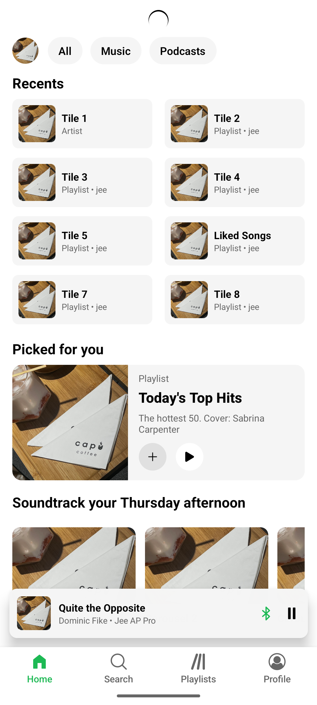
  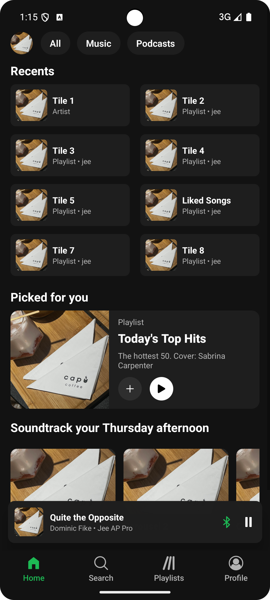
</p>
<p align="center">
  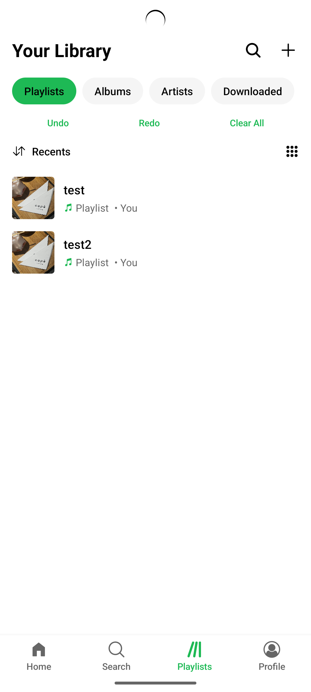
  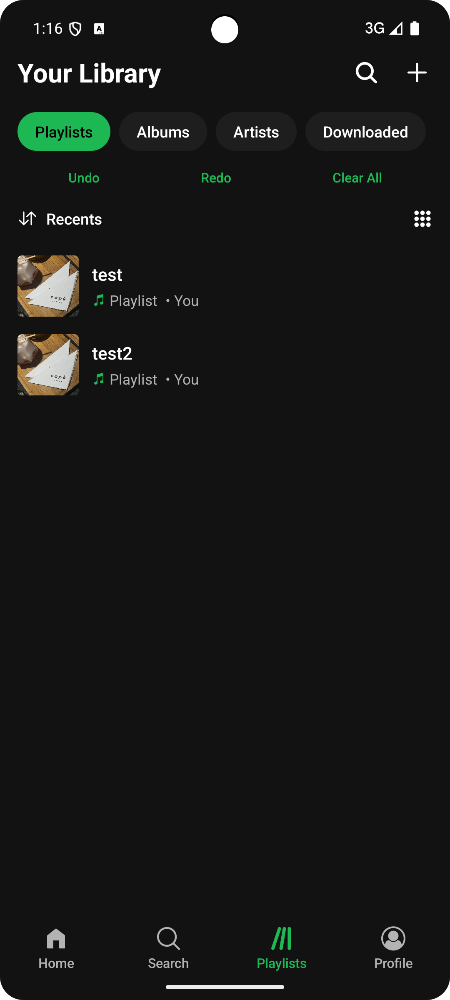
  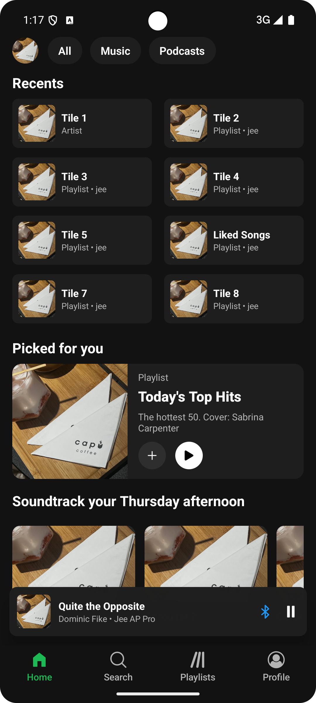
</p>
<p align="center">
  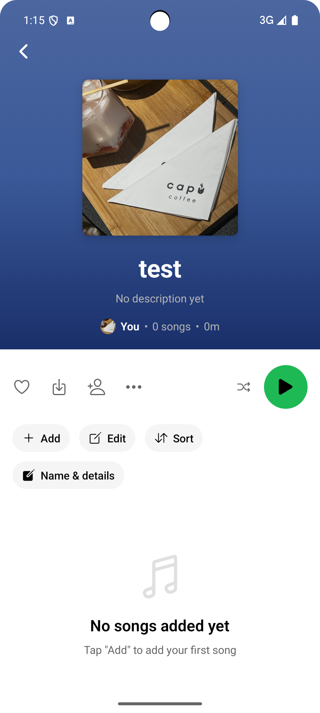
  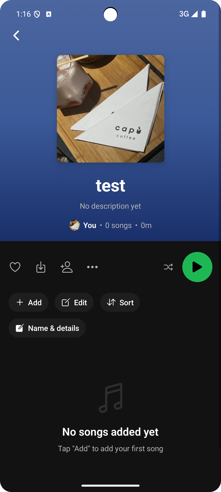
  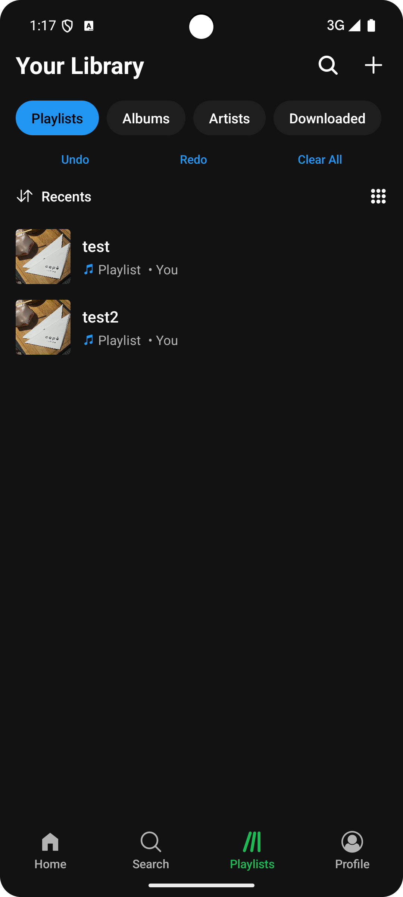
</p>
<p align="center">
  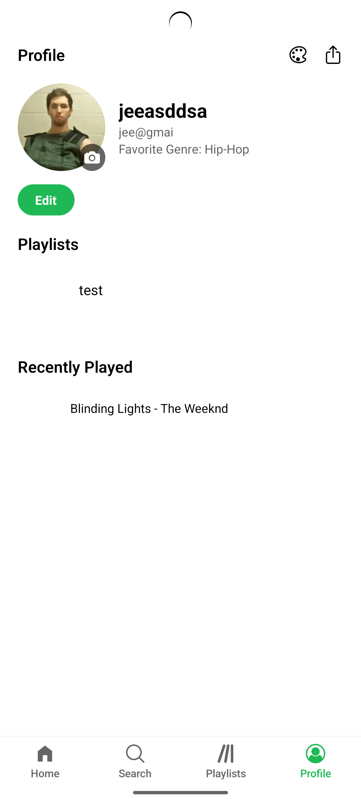
  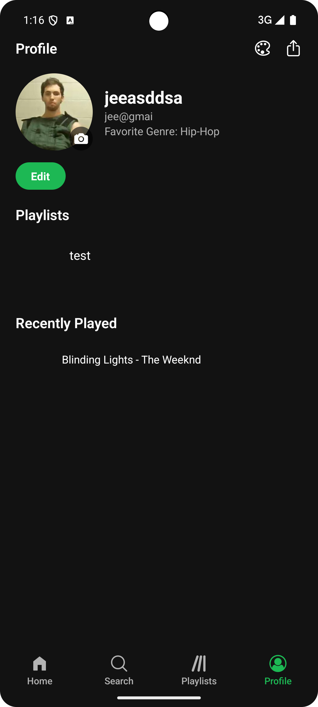
  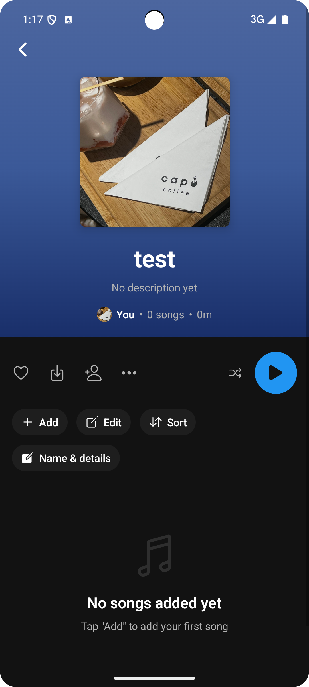
</p>
<p align="center">
  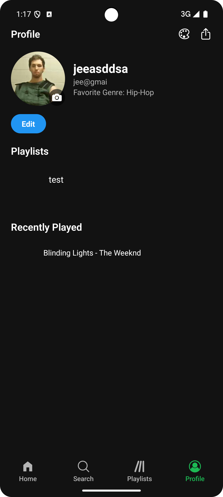
</p>

Week 5 Activity 2 (Camera with Filters & Interactive Editing)
<p> We implemented a fully featured camera system that allows users to capture a profile photo with real-time filters (grayscale & sepia), apply interactive pinch/zoom/pan cropping inside a square frame, rotate the image, and bake the final filtered & cropped result into persistent storage. The captured image is saved locally (with cleanup of older versions) and immediately updates the profile. The editing flow includes an animated save overlay to prevent black screen flashes and ensures a smooth return to the profile screen. </p>
<p align="center">
  
  
  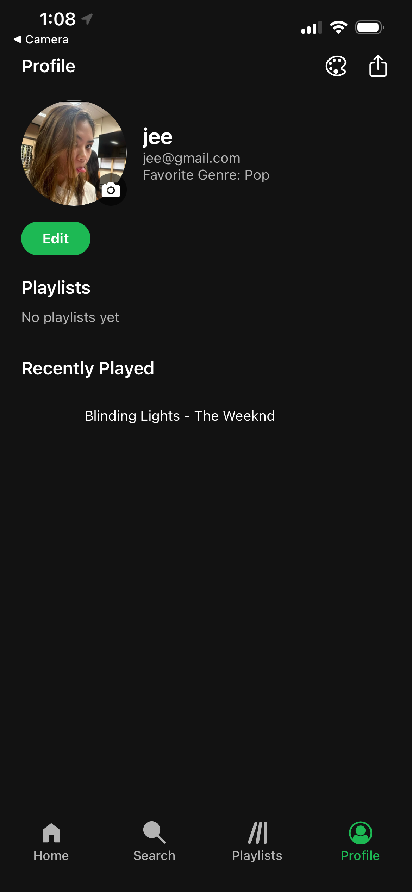
</p>

Week 6 Activity 1 (iOS Build & Deployment)
<p> We migrated the project to a native iOS workspace using <code>expo prebuild</code>, installed CocoaPods, and built the app with Xcode. The app now runs on iOS Simulator and device with all core features (authentication, playlists, profile, theming, and the advanced camera/editor). Below are screenshots from the iOS build, including the save password prompt and key screens.</p>
<p align="center">
  
  
  
  
  
</p>

Week 6 Activity 2 (Location-Based Map Features)
<p> We integrated real-time location tracking and interactive map features into the profile screen using <code>expo-location</code> and <code>react-native-maps</code>. The implementation includes:</p>
<ul>
  <li><strong>Real-time Location Tracking:</strong> Displays user's current location on a custom-styled dark mode map with accurate positioning</li>
  <li><strong>Custom Points of Interest:</strong> Three mock music-related landmarks (Music Studio, Concert Hall, Music Store) with custom markers that change color when active</li>
  <li><strong>Geofencing Alerts:</strong> Automatic notifications when entering or leaving 100-meter radius zones around each point of interest</li>
  <li><strong>Interactive Map Controls:</strong> Zoom in/out buttons, center-on-user button, and full pan/pinch gesture support</li>
  <li><strong>Custom Dark Map Style:</strong> Applied a sophisticated dark theme JSON style configuration for enhanced visual design matching the Spotify aesthetic</li>
  <li><strong>Status Indicators:</strong> Live badge showing how many geofenced locations you're currently near</li>
</ul>
<p>The map component is fully integrated into the profile page under "Nearby Music Spots" and works seamlessly across iOS and Android with proper permission handling.</p>
<p align="center">
  
  
</p>


## 🔧 Tech Stack
- Expo
- React Native
- Expo Router
- React Native Linear Gradient
- Redux Toolkit (State Management)
- React Native Reanimated (Animations)
- AsyncStorage (Persistence)

## 📜 License
This project is developed for educational purposes.
You are free to use, modify, and share with attribution.